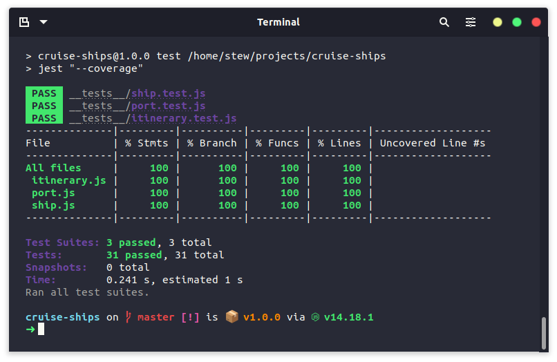

# MCR Codes Cruise Ship
This is my cruise ship project for [Manchester Codes](https://www.manchestercodes.com/) as part of the Programming Fundamentals module.

## Description
The main purpose of this project is to practice OOP (Object-oriented Programming) as well as how to emulate dependencies in tests using mocks.

## Features
* Create cruise ships, and cruise ship itineraries that hold ports.
* Allow the cruise ship to travel to each of the ports in the itinerary, starting from the first port.

## Requirements
* [Node JS](https://nodejs.org/en/) - to run the program in the command line.

### Application Dependencies
Currently no application dependencies.

### Development Dependencies
[Jest](https://jestjs.io/) - used for unit testing.

## Getting Started
### CLI
1. Clone the repository to your local machine with `git clone` (or alternatively, download the zip).
2. In the terminal, navigate into the directory that you cloned the repository in to.
3. Enter the Node REPL via the `node` command in the terminal.
4. Import the required modules:
    * `const Ship = require('./src/ship.js');`
    * `const Port = require('./src/port.js');`
    * `const Itinerary = require('./src/itinerary.js');`
5. Set up some ports, an itinerary, and a ship:
    * ```javascript
        const myShipConfig = {
            _itinerary: new Itinerary({
                ports: [
                    new Port({ name: 'My Port 1' }),
                    new Port({ name: 'My Port 2' }),
                    new Port({ name: 'My Port 3' })
                ]
            })
        };

        const myShip = new Ship(myShipConfig);
      ```
6. Now you have access to the following properties/methods on your Ship instance:
    * `myShip._itinerary;` - will show you the current itinerary.
    * `myShip._previouslyDockedPorts;` - will show you all of the ports you have stopped at.
    * `myShip._setSail();` - ship will depart it's starting port.
    * `myShip._dock();` - ship will dock at it's next available stop in the itinerary.

### GUI
Coming soon.

## Testing
Built using a TDD approach. Each unit was first written as a failing test, which was then built out as per the tests, and later refactored, tested again.

At some points I did have to spike, but after I had spiked to make sure it was possible, I would delete the code, and write the failing test, and then build out the functionality, and repeat the testing process.

All tests are located inside of the `__tests__` directory.

If you wish to run the tests for yourself, you can install Jest by running `npm install` and from there you can run the tests by running `npm test`.



## Future Plans
* Add a GUI to the application.
